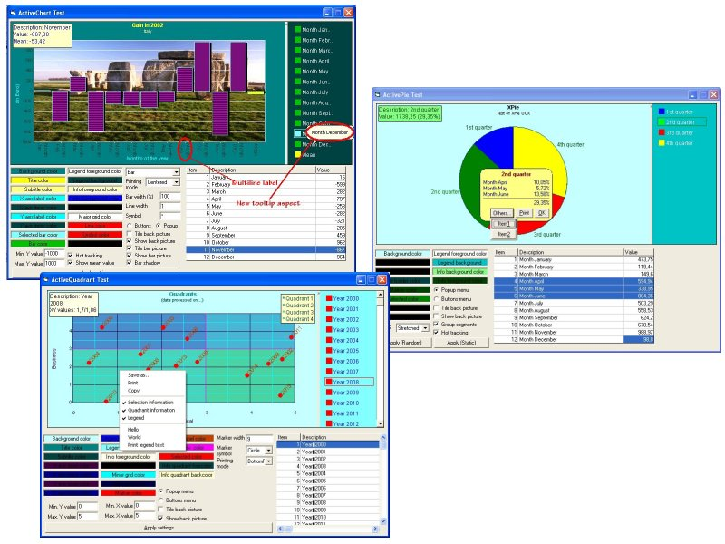



## GraphXSuite \(XChart, XPie, XQuadrant\)

### Description

Hi! Due to some enhancements needed in my applications, I decided to do improvements in XChart.

I had no time to implement requirements coming from PSC users, but some significant changes were made,

above all regarding the GUI and the printing.

Also, I needed two more OCX for viewing data through 2D-pie (XPie) and a chartesian plan (XQuadrant),

showing data in four quadrants.

I'ts quite difficult to explain the capabilities of all the OCXs, so I let the pictures speak!

I tested them hardly (WinXP, Win2000 and WINNT), since I has to release them in a package, so I hope they're fully bug free.

Please let me know if it's all ok or some bugs are present again.

I'm very sorry for not implementing all PSC users' requirements, but I think to have produced

a couple of useful OCXs, to enable users a good way of data presentation.
 
### More Info
 

             |
---                |---
**Submitted On**   |2003-12-01 14:54:20
**By**             |[mcosta68](https://github.com/Planet-Source-Code/PSCIndex/blob/master/ByAuthor/mcosta68.md)
**Level**          |Advanced
**User Rating**    |5.0 (150 globes from 30 users)
**Compatibility**  |VB 6\.0
**Category**       |[OLE/ COM/ DCOM/ Active\-X](https://github.com/Planet-Source-Code/PSCIndex/blob/master/ByCategory/ole-com-dcom-active-x__1-29.md)
**World**          |[Visual Basic](https://github.com/Planet-Source-Code/PSCIndex/blob/master/ByWorld/visual-basic.md)
**Archive File**   |[GraphXSuit1679231222003\.zip](https://github.com/Planet-Source-Code/mcosta68-graphxsuite-xchart-xpie-xquadrant__1-50266/archive/master.zip)

